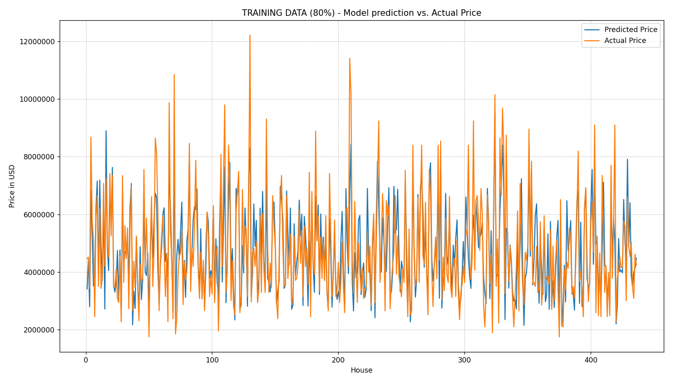
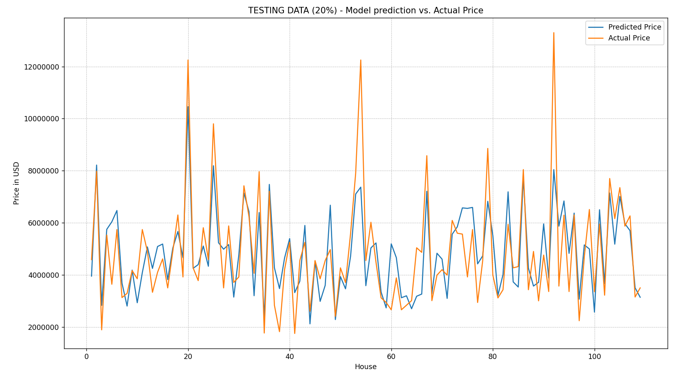
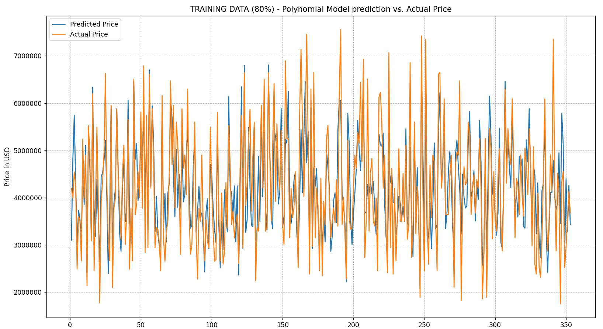
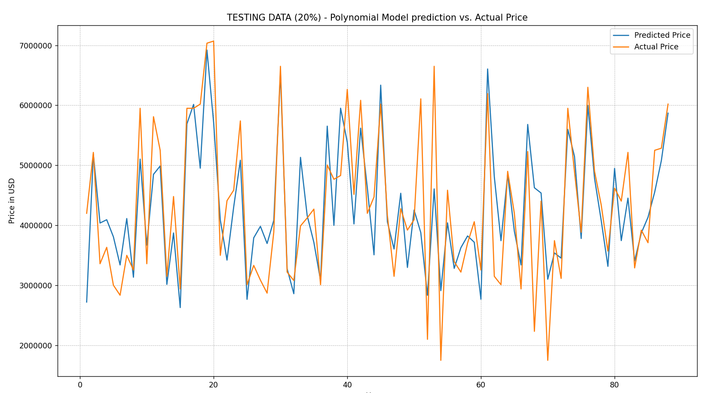

# Leo Carten - WIT Math for ML Final Project
This contains assignment details, my thoughts, and my notes for the project. This is in reference to `FINAL-PROJECT-Math5700-project-Fall2025.pdf`.

# Part 1) Data
I decided to create a model that can predict housing prices based on `area,bedrooms,bathrooms,stories,mainroad,guestroom,basement,hotwaterheating,airconditioning,parking,prefarea,furnishingstatus` with information below:

| Feature              | Description                                                                 |
|----------------------|-----------------------------------------------------------------------------|
| Area                 | The total area of the house in square feet.                                 |
| Bedrooms             | The number of bedrooms in the house.                                        |
| Bathrooms            | The number of bathrooms in the house.                                       |
| Stories              | The number of stories in the house.                                         |
| Mainroad             | Whether the house is connected to the main road (Yes/No).                   |
| Guestroom            | Whether the house has a guest room (Yes/No).                                |
| Basement             | Whether the house has a basement (Yes/No).                                  |
| Hot water heating    | Whether the house has a hot water heating system (Yes/No).                  |
| Airconditioning      | Whether the house has an air conditioning system (Yes/No).                  |
| Parking              | The number of parking spaces available within the house.                    |
| Prefarea             | Whether the house is located in a preferred area (Yes/No).                  |
| Furnishing status    | The furnishing status of the house (Fully Furnished, Semi-Furnished, Unfurnished). |

This dataset is from [Kaggle](https://www.kaggle.com/datasets/harishkumardatalab/housing-price-prediction).

# Part 2) Fit a Linear Model Using Least Squares
Please keep in mind, this part of the exercise is to **just** create a simple linear model. This does not include polynomial model fitting, normalizing features, removing extreme outliers, etc...
### (a) Fit a Linear Model
The **linear model generated** was: `227.43*area + 158179.57*bedrooms + 996303.72*bathrooms + 400978.74*stories + 426421.69*mainroad + 355875.69*guestroom + 390353.83*basement + 1008915.14*hotwaterheating + 910874.33*airconditioning + 258631.65*parking + 585527.9*prefarea + 170849.95*furnishingstatus + -85395.98`

### (b) Compute Training Error
The **MSE** was: `1,049,204,674,200.37`

**RMSE** is a good way to see how "off" the model was per value, this is: `$1,024,306.92`

**Linear model assessment**: Since this model does not include polynomial model fitting, normalizing features, or removing extreme outliers, I think this model performed relatively well given `mean=4,742,611.10` and `median=4,340,000.00`.
### (c) Compute Test Error
The **MSE** was: `1,424,310,603,151.25`

**RMSE** is a good way to see how "off" the model was per value, this is: `$1,193,444.85`

**Linear model assessment**: Since this model does not include polynomial model fitting, normalizing features, or removing extreme outliers, I think this model performed relatively well given `mean=4,863,201.83` and `median=4,480,000.00`.

Please see images below to assess model performance, notice the linear model does not handle outliers well:

# Part 3) Fit a Polynomial Model Using Least Squares
### (b) Compute Training Error
The **MSE** was: `588,853,337,443.24`

**RMSE** is a good way to see how "off" the model was per value, this is: `$767,367.8`

I think this model performed relatively well given `mean=4,208,318.70` and `median=4,060,000.00`.
### (c) Compute Test Error
The **MSE** was: `523,354,451,032.18`

**RMSE** is a good way to see how "off" the model was per value, this is: `$723,432.41`

I think this model performed relatively well given `mean=4,315,221.59` and `median=4,200,000.00`.
### (d) Additional info about how I made the Polynomial Model more accurate
Below are the things I did (or tried) to improve this model other than adding polynomial terms:
- I tried adding polynommial terms of different degrees (e.g. `^2` or `^3`) to multiple features to see how the curve of the graph was changed.
- I removed outliers by calculating z-scores of all features and removed things that were `+-2.5` standard deviations away from the mean.
- I used the `FigureOutColumnsToDropBasedOnCorrlation()` function and tried removing some features by calculating the correlations of each feature and how they relate to other features.
- I fixed how I pre-processed my data by changing how i quantified tri-nary features, e.g. the `furnished` feature. Previously it was `-1,0,1`, but I changed it to `0,1,2`.

- 